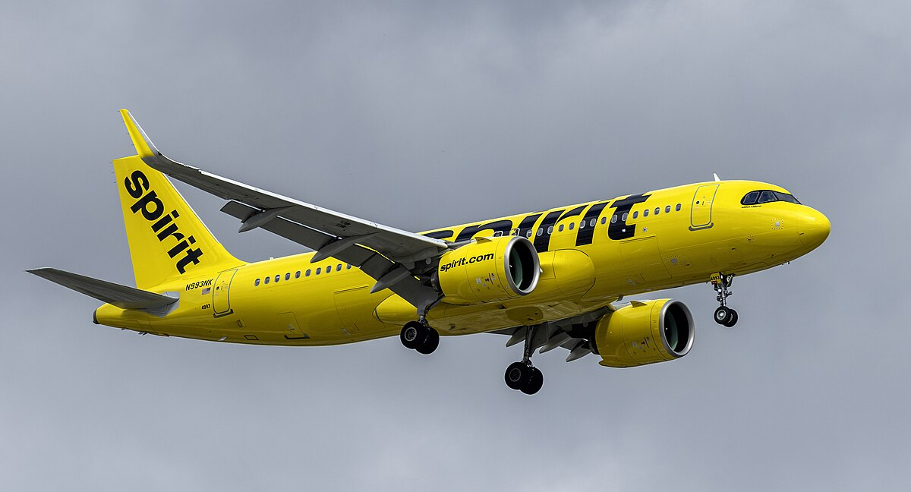
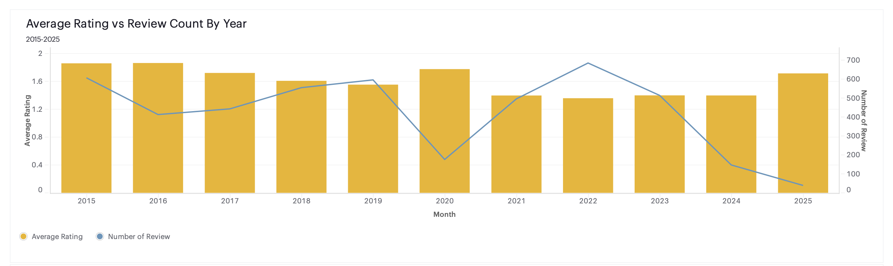
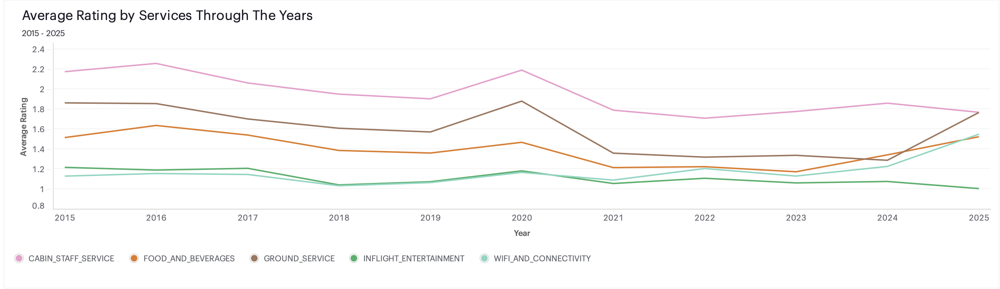
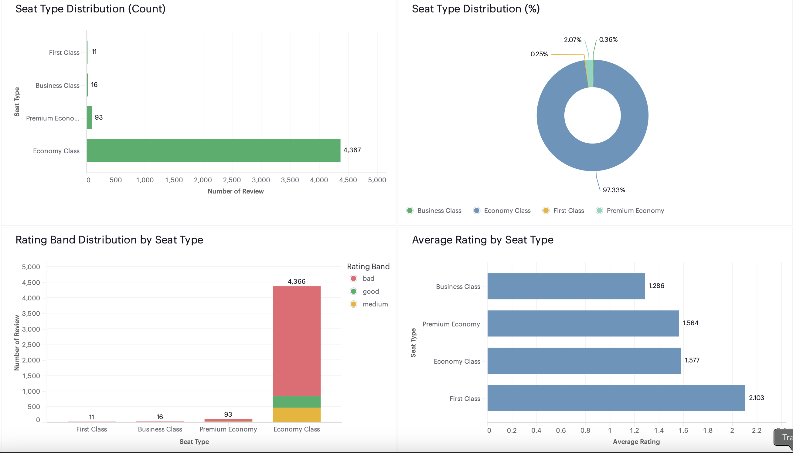
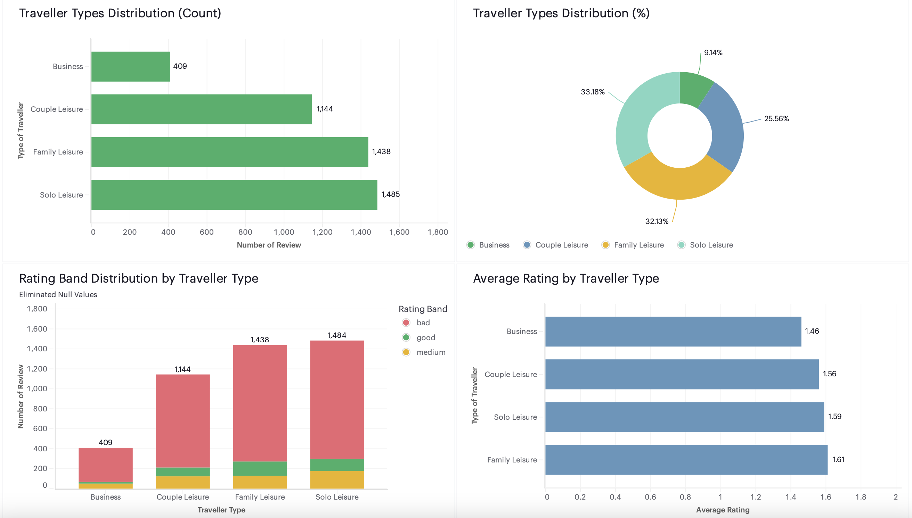
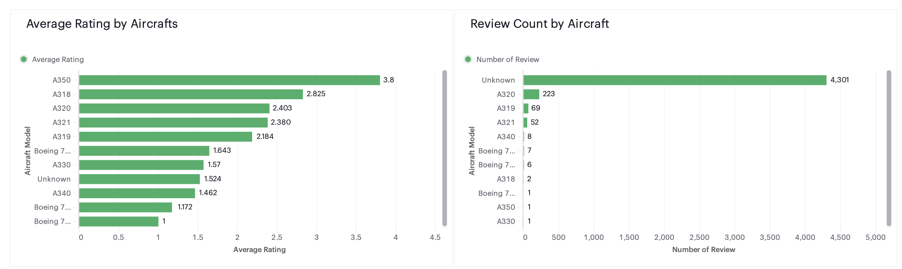
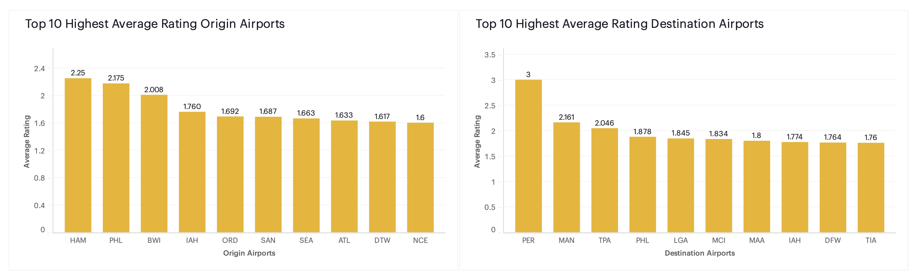
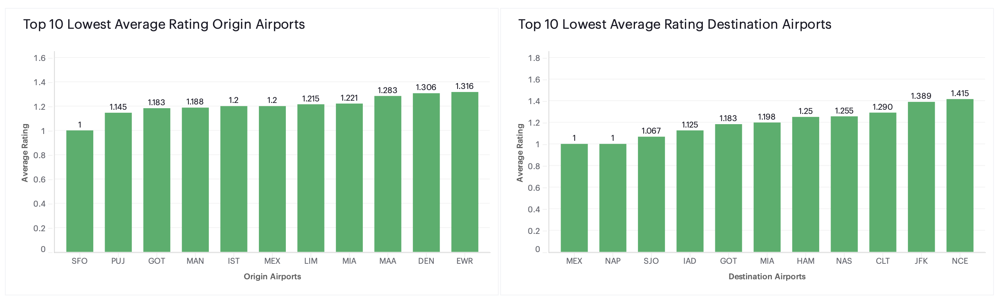
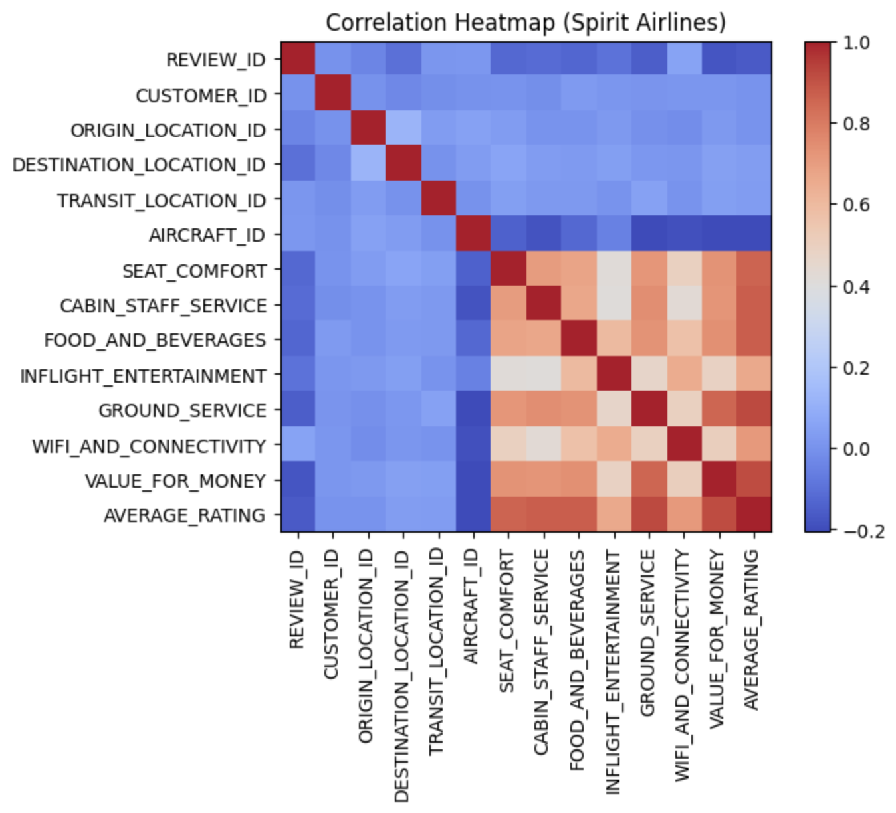

# Skytrax Spirit Airlines Analysis

  

Analyzed **4,510 Spirit Airlines reviews (2015–2025)** using SQL + Python + Mode Analytics to uncover satisfaction drivers. Findings show **chronic dissatisfaction** (avg rating **1.59/5**, **87.86%** not recommending). Weakest areas are **Wi-Fi & Connectivity (1.13)** and **Inflight Entertainment (1.11)**; relatively stronger but still low is **Cabin Staff Service (1.95)**. Segment deep-dives (seat type, traveller type) highlight **Business Class** as the lowest-rated group.

**Access the dashboard PDF:**  
[Spirit Airlines Customer Satisfaction Dashboard](dashboard/Mia_Tran_Spirit_Airlines_Dashboard_20250929.pdf)

---

## 1. Overview
- **Scope:** 4,510 Skytrax reviews filtered to **Spirit Airlines** (2015–2025).
- **Goal:** Identify key drivers of customer satisfaction and convert them into targeted improvement actions.
- **Method:**
  - **SQL** (warehouse/CSV) for extraction & prep
  - **Python** (Pandas, Matplotlib) for validation and one analytical figure (correlation map)
  - **Mode Studio** for the **interactive dashboard** and most visuals
- **Top Insights (high level):**
  - **Weak overall sentiment:** `Average_Rating = 1.59/5`, **87.86%** of reviewers do **not** recommend.
  - **Service gaps:** Wi-Fi & Inflight Entertainment near **1.1/5**; Cabin Staff ~**1.95** (still below acceptable).
  - **Segments:** **Business Class** and **Economy** show the largest concentration of “bad” ratings; Business has **0%** “good” ratings in this sample.
  - **Airports:** Some origins/destinations (e.g., **MIA**, **MEX**) repeatedly appear among the lowest-rated.

---

## 2. Data Processing and Analysis Workflow

### 2.1. Data
- Load Spirit-filtered Skytrax reviews (CSV) into SQL/Python.
- Validate schema (types, nulls, ranges) and align service-score scales (1–5).

### 2.2. Cleaning
- Normalize categorical values (aircraft labels, seat & traveller types).
- Standardize airport/location identifiers and remove impossible values.
- Drop/review rows with missing core metrics (`AVERAGE_RATING`, service scores) when required by a given chart.

### 2.3. Feature Preparation
- Flags: `RECOMMENDED` (True/False), rating bands (`bad <2`, `medium <4`, `good ≥4`).
- Groupings: **Seat Type** (Economy, Premium Economy, Business, First), **Traveller Type** (Solo/Family/Couple Leisure, Business).
- Route context: origin/destination/transit IDs (for airport charts).

### 2.4. Modeling/Analysis
- Descriptives and share-of-total summaries for KPIs and segments.
- **Correlation analysis** between service scores and overall rating (Python) for diagnostic context.

### 2.5. Validation
- Spot-check outliers (e.g., aircraft models with N=1) and annotate where insights are not generalizable.
- Compare dashboard aggregates with Python cross-tabs to ensure parity.

### 2.6. Visualization
- **Mode Studio** for most charts (time trends, segments, airports, aircraft).
- **Python** only for the **Correlation Heatmap**.
- Filters in the dashboard: year, seat type, traveller type, route.

---

## 3. Insights (with Dashboard Figures)

### 3.1. Overall Customer Satisfaction

- **Total Reviews:** **4,510**  
- **Average Rating:** **1.59**  
- **Rating Bands:** **80.60% bad**, **8.16% good**, **11.22% medium**, **0.02% unknown**  
- **Recommendation:** **87.86% false**, **12.14% true**  
- **Service Averages:** Cabin Staff **1.95**, Seat Comfort **1.57**, Food & Beverages **1.37**, Inflight Entertainment **1.11**, Wi-Fi & Connectivity **1.13**

> Takeaway: Persistent dissatisfaction across the board; connectivity/entertainment are the clearest pain points.

---

### 3.2. Satisfaction Trends Through Time

  
   
  

- Ratings **consistently < 1.9** across the period.
- Higher review volumes (2019–2022) correspond with **lower ratings** → visibility often brings more negative feedback.
- **Cabin Staff** relatively higher but **declining**; **Wi-Fi** and **Entertainment** flat near **1.2**.

---

### 3.3. Satisfaction by Customer Type — Seat Type

  

- **Economy = 97.33%** of reviews; **Premium Economy = 2.07%**; Business and First ~0.6% combined.
- **Business Class** has the **highest share of “bad”** ratings (**81.25%**) and **0% “good”** ratings.
- **Average Rating:** Business **1.286**, Economy **1.564**, Premium Economy **1.577**, First **2.103**.
- By service, Business is weakest across **all five** factors; First leads but still modest (e.g., Staff **2.78**, IFE **2.33**).

---

### 3.4. Satisfaction by Customer Type — Traveller Type

  

- Sizeable groups: **Solo Leisure 33.18%**, **Family 32.13%**, **Couple 25.56%**, **Business 9.14%**.
- **Business travellers**: highest “bad” share (**83.31%**) and lowest “good” (**4.16%**).
- **Average Rating:** Business **1.46** (lowest), Solo **1.59**, Couple **1.56**, Family **1.61**.
- Across services, Business is lowest on average, though gaps to leisure segments are modest.

---

### 3.5. Satisfaction by Aircraft and Airports

  

- Aircraft results with **higher scores** (e.g., **A350 = 3.8**) are based on **N≈1** → **not reliable**.
- **Unknown** aircraft accounts for **4,301** reviews, limiting aircraft-based analysis.

  
   
  

- **PHL** and **IAH** appear among the **top** for both origin and destination.
- **MIA**, **GOT**, **MEX** appear among the **bottom** for both sides.
- Some airports switch rank depending on origin vs destination (**MAN**, **MAA**, **NCE**), hinting at differences in **departure vs arrival** experiences.

---

### 3.6. Correlation Heatmap (from EDA)

  

- `AVERAGE_RATING` correlates most with **VALUE_FOR_MONEY** and **CABIN_STAFF_SERVICE**.
- **Wi-Fi** and **Entertainment** remain weak and contribute to lower overall satisfaction.

---

## 4. Recommendations

### 4.1. Core Service Fixes
- **Wi-Fi & Connectivity:** prioritize reliability and coverage; renegotiate provider SLAs; roll out hardware upgrades by fleet/route.
- **Inflight Entertainment:** baseline offering on longer routes (streaming portal or curated content) to lift scores from ~1.1.

### 4.2. People & Comfort
- **Cabin Staff:** targeted training on service recovery & empathy; reinforce consistency across crews.
- **Seat Comfort:** quick wins (cushioning, cleanliness, broken seat remediation) and longer-term layout improvements on high-complaint routes.

### 4.3. Segment Plays
- **Business Class:** rebuild value proposition (priority services, reliable Wi-Fi, work surfaces, beverage/food upgrades); set SLA targets per pain point.
- **Economy (97% of volume):** focus on the basics—cleanliness, predictability, on-board comms—to lift mass sentiment.

### 4.4. Network & Ops
- **Airport partnerships:** engage with **MIA/MEX/GOT** on joint fixes (check-in, boarding, signage); replicate best practices from **PHL/IAH**.
- **Feedback loop:** increase post-flight outreach to boost recent reviews and monitor change impact.

---

## 5. Key Learnings

### 5.1. Technical
- Built an **end-to-end pipeline** (SQL → Python checks → Mode Studio).
- Constructed an **interactive dashboard** with year/segment filters.
- Produced a **correlation map** in Python to ground dashboard stories.

### 5.2. Analytical
- **Segment-first** lens (seat & traveller types) exposes different pain points (e.g., Business vs Economy).
- Read results with **sample-size awareness** (aircraft charts with N≈1 not actionable).

### 5.3. Communication
- Translated metrics into **operational levers** (Wi-Fi/IFE upgrades, crew training, airport coordination).

---

## 6. Limitations
- Single-airline scope (no competitor benchmark).
- Unobserved variables (fare paid, delay minutes, aircraft age/config).
- Correlations ≠ causation; route length/season/class mix may confound results.
- Aircraft insights limited by **Unknown** label dominance and tiny Ns for some models.

---

## 7. Next Steps
- **Benchmarking:** compare with peers (Frontier, JetBlue) by route/class.
- **Text mining:** topic & sentiment on `REVIEW_TEXT` for root-cause patterns.
- **Modeling:** multivariate regressions or trees to quantify drivers of `AVERAGE_RATING` and `RECOMMENDED`.
- **Data enrichment:** on-time performance, cancellations, fare buckets, aircraft age.
- **Monitoring:** monthly refresh with automated QA and KPI tracking.

---

## Repository
